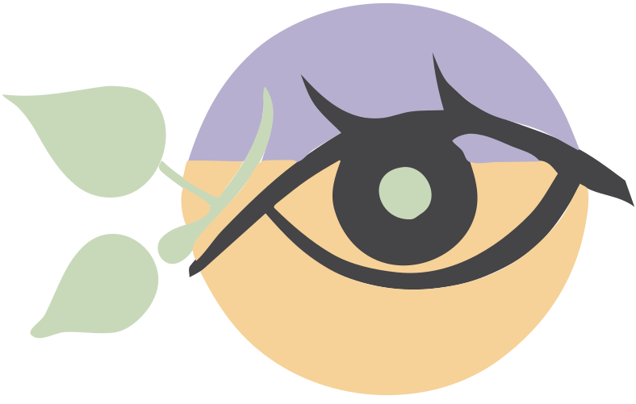

<h1 align="center">
  
  <p>Where Are My Vines ?</p>
</h1>

<p align="center">⚠️ This is a work in progress. ⚠️</p>

WArM-V is image processing pipeline to absorb photos collected in vineyards to create a digital twin of **one** vine row. The data is processed in near real-time on the edge to reduce the amount of data to upload on the cloud where the entire vineyard model is updated and analyzed.

## Roadmap

- [ ] Design a pipeline to absorb the data and create a digital twin of the vine row.
- [x] Get started with [Open CV](https://opencv.org) and the [stitching sample](https://docs.opencv.org/4.x/d8/d19/tutorial_stitcher.html)
- [ ] Build a first [stitching pipeline](https://docs.opencv.org/4.x/d1/d46/group__stitching.html) (i.e. image alignment & composition) for vineyard images.
- [ ] Develop the designed processing pipeline.

## Design

### High-level Overview

Below is a workflow diagram describing WArM-V image processing pipeline to achieve online estimation of post & trunks positions. An additional pipeline to generate human-readable preview of the pipeline result is also presented.

<p align="center">
  
</p>

#### Cameras Isolation

The pipeline in the diagram above is duplicated for each cameras. In particular, each camera pipeline is completely independent can easily run in parallel. If enough computing resources are available, this enable for better runtime performances.

Of course, we could gain precision on position estimates by sharing [state estimation](#state-estimation) across pipelines. But complete isolation between pipelines reduce design complexity and increase the overall robustness of the system (one camera failure do not impact the other camera work).

#### Pipeline Multithreading

The pipeline itself can be parallelized. As depicted on the diagram, the state estimation, the image alignment and the object detection can mostly run in parallel.

Actually, it can start processing a new image before having fully processed the previous one. In particular, there is only three synchronization constraint (i.e. wait for last image related step to be completed) :

- Image aliner must wait for previous image to be available in the database (this should always be true anyway)
- State estimator must wait for last step estimate to be refined with computer vision data.
- Duplicate merger must wait for previous image duplicate to be removed.

### Image Alignment

📝 TODO

### State Estimation

State estimation can help further increase the performance of the image alignment algorithm by providing a first guess on the homography.

## Getting Started

> The design above has not been implemented. The following are just artifacts of my first experiments with Open CV.

### Prerequisites

To build this project, you will need

- a C++ compiler
- [CMake](https://cmake.org) build system.
- [OpenCV](https://opencv.org)

#### Install on macOS

> [Homebrew](https://brew.sh) package manager is used to easily install & manage software on macOS.

```bash
sudo xcode-select --install
brew install cmake
brew install opencv
brew link opencv
```

If needed, one could always [build from source](https://docs.opencv.org/4.x/d0/db2/tutorial_macos_install.html) instead.

For other platforms, please head to [Open CV's documentation](https://docs.opencv.org/4.x/df/d65/tutorial_table_of_content_introduction.html).

### Build

- Move to the project directory

  ```bash
  cd <path/to/warm-v>
  ```

- If needed, create a `build` directory. You can optionally remove old build artifacts.

  ```bash
  rm -rf build
  mkdir -p build
  ```

- Build the project

  ```bash
  cd build
  cmake ..
  make
  cd -
  ```

### Run

- Move to the project directory

  ```bash
  cd <path/to/warm-v>
  ```

- Create directory structure for dataset & stitching result

  ```bash
  mkdir -p data/inputs
  mkdir -p data/outputs

- Get some images to stitch from [OpenCV dataset](https://github.com/opencv/opencv_extra/tree/4.x/testdata/stitching) and put them in `inputs` directory.

  ```bash
  cd data/inputs
  wget https://github.com/opencv/opencv_extra/raw/4.x/testdata/stitching/boat1.jpg
  wget https://github.com/opencv/opencv_extra/raw/4.x/testdata/stitching/boat2.jpg
  wget https://github.com/opencv/opencv_extra/raw/4.x/testdata/stitching/boat3.jpg
  wget https://github.com/opencv/opencv_extra/raw/4.x/testdata/stitching/boat4.jpg
  wget https://github.com/opencv/opencv_extra/raw/4.x/testdata/stitching/boat5.jpg
  wget https://github.com/opencv/opencv_extra/raw/4.x/testdata/stitching/boat6.jpg
  cd -
  ```

- Run the stitching pipeline

  ```bash
  ./script/stitching_detailed.bash
  ```

- Have a look at the stitched image `data/outputs/stitching_result.jpeg`.

### Going Further

- [Open CV's stitching pipeline](https://docs.opencv.org/4.x/d1/d46/group__stitching.html)
- [Open CV's `Stitcher` tutorial](https://docs.opencv.org/4.x/d8/d19/tutorial_stitcher.html)
